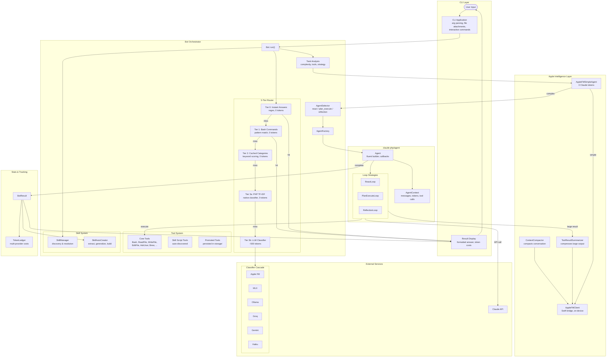

# PhpBot

PhpBot is a PHP CLI AI assistant that turns natural-language requests into concrete actions. It uses a multi-tier routing system to minimize LLM costs, supports on-device Apple Intelligence (macOS 26+), and can auto-create reusable skills from completed tasks.

Built on top of [claude-php/agent](https://github.com/claude-php/agent).

## Architecture



## How It Works

1. **Route** — A 5-tier router tries to handle the request at the cheapest possible level. Instant answers and bash commands cost zero tokens. Only ambiguous requests escalate to LLM classification.
2. **Analyze** — The task is analyzed for complexity, required tools, and success criteria.
3. **Shortcut** — If the task is simple bash, the Apple FM Simple Agent handles it entirely on-device (zero Claude tokens).
4. **Select** — An agent strategy is chosen (`react`, `plan_execute`, or `reflection`) and only the needed tools are loaded.
5. **Execute** — The `claude-php/agent` framework runs the loop: call Claude, execute tools, feed results back, repeat.
6. **Optimize** — Apple FM intercepts large tool results to summarize them before they reach Claude, and compacts conversation history as it grows.
7. **Evolve** — After a successful multi-step task, skills can be auto-created for reuse next time.

## What's In This Repo

```
bin/                    CLI entrypoint and helper scripts
config/phpbot.php       Runtime configuration (env-aware)
src/
  Apple/                Apple FM client, summarizer, compactor, simple agent
  Agent/                Agent strategy selector
  CLI/                  CLI application and file resolver
  Prompt/               Tiered system prompt builder
  Registry/             Persistent tool registry
  Router/               5-tier cached router, classifiers, route cache
  Skill/                Skill assessment, extraction, generalization
  Stats/                Multi-provider token ledger
  Storage/              Credential key store
  Tools/                Built-in tools (bash, file ops, brew, etc.)
  Bot.php               Main orchestrator
  BotResult.php         Execution result value object
  AgentFactory.php      Creates configured Agent instances
  ToolRegistrar.php     Registers and selects tools
  SkillAutoCreator.php  Auto-creates skills from successful runs
  ProgressSummarizer.php  Iteration progress summaries
  StaleLoopGuard.php    Detects stuck agent loops
  TaskAnalyzer.php      LLM-powered task analysis
skills/                 Reusable skills (SKILL.md + scripts)
storage/                Persisted tools, keys, and runtime artifacts
frontend/               Optional web UI (React + Vite)
```

## Installation

1. Clone the repository:

   ```bash
   git clone https://github.com/dalehurley/phpbot.git
   cd phpbot
   ```

2. Install dependencies:

   ```bash
   composer install
   ```

3. Configure your environment:

   ```bash
   cp .env.example .env
   # Edit .env and set at minimum:
   #   ANTHROPIC_API_KEY=your-api-key
   ```

   Or export directly:

   ```bash
   export ANTHROPIC_API_KEY='your-api-key-here'
   ```

## Usage

Interactive mode (default):

```bash
./bin/phpbot
./bin/phpbot -i
```

Single command:

```bash
./bin/phpbot "List all PHP files in the current directory"
./bin/phpbot -c "Create a Laravel migration for a users table"
```

With file attachments:

```bash
./bin/phpbot "Explain this code" @src/Bot.php
./bin/phpbot "Review these files" @src/Router/*.php
```

Options:

```
-h, --help         Show help message
-V, --version      Show version information
-v, --verbose      Enable verbose output
-i, --interactive  Run in interactive mode
-l, --list-tools   List all available tools
-c, --command      Run a single command
```

Interactive commands:

```
/help              Show help
/tools             List available tools
/skills            List available skills
/scripts           List available scripts
/file <path>       Attach a file to the conversation
/pick              Open a file picker dialog (macOS)
```

## Configuration

All configuration lives in `config/phpbot.php` and can be overridden via environment variables:

| Variable                | Default             | Description                    |
| ----------------------- | ------------------- | ------------------------------ |
| `ANTHROPIC_API_KEY`     | —                   | Anthropic API key (required)   |
| `PHPBOT_MODEL`          | `claude-sonnet-4-5` | Primary model                  |
| `PHPBOT_FAST_MODEL`     | `claude-haiku-4-5`  | Fast/cheap model               |
| `PHPBOT_SUPER_MODEL`    | `claude-opus-4-5`   | High-capability model          |
| `PHPBOT_MAX_ITERATIONS` | `25`                | Max agent loop iterations      |
| `PHPBOT_MAX_TOKENS`     | `4096`              | Max tokens per response        |
| `PHPBOT_TEMPERATURE`    | `0.7`               | Response temperature (0.0-1.0) |
| `PHPBOT_TIMEOUT`        | `300`               | API request timeout (seconds)  |

### Router Classifier

The router classifier determines how ambiguous requests (those not caught by the first 4 tiers) are categorized. Set `PHPBOT_CLASSIFIER_PROVIDER` to one of: `auto`, `apple_fm`, `mlx`, `ollama`, `lmstudio`, `groq`, `gemini`, `anthropic`.

With `auto` (default), providers are tried in order of preference:

| Priority | Provider  | Type      | Cost       | Setup                                                            |
| -------- | --------- | --------- | ---------- | ---------------------------------------------------------------- |
| 1        | Apple FM  | On-device | Free       | macOS 26+, auto-compiles Swift bridge                            |
| 2        | MLX       | Local GPU | Free       | `pip install mlx-lm && python bin/mlx-classify-server.py`        |
| 3        | Ollama    | Local     | Free       | `brew install ollama && ollama pull qwen2.5:1.5b`                |
| 4        | LM Studio | Local     | Free       | [lmstudio.ai](https://lmstudio.ai) — load any model              |
| 5        | Groq      | Cloud     | Free tier  | [console.groq.com](https://console.groq.com) — get API key       |
| 6        | Gemini    | Cloud     | Very cheap | [aistudio.google.com](https://aistudio.google.com) — get API key |
| 7        | Haiku     | Cloud     | Paid       | Always available as fallback                                     |

### Apple Foundation Models

On macOS 26+ (Tahoe), Apple FM provides free on-device intelligence for:

- **Request classification** — Route requests without any cloud LLM call
- **Tool result summarization** — Compress large bash output and file contents before sending to Claude
- **Progress summaries** — Generate iteration summaries without Anthropic tokens
- **Simple task execution** — Handle basic bash tasks entirely on-device
- **Context compaction** — Keep conversation history lean across iterations

| Variable                              | Default | Description                         |
| ------------------------------------- | ------- | ----------------------------------- |
| `PHPBOT_APPLE_FM_ENABLED`             | `true`  | Enable Apple FM integration         |
| `PHPBOT_APPLE_FM_SUMMARIZE`           | `true`  | Summarize large tool results        |
| `PHPBOT_APPLE_FM_SUMMARIZE_THRESHOLD` | `800`   | Chars above which to summarize      |
| `PHPBOT_APPLE_FM_SKIP_THRESHOLD`      | `500`   | Chars below which to pass through   |
| `PHPBOT_APPLE_FM_PROGRESS`            | `true`  | Use Apple FM for progress summaries |

### Stale Loop Detection

Prevents the agent from wasting iterations when stuck:

| Variable                         | Default | Description                             |
| -------------------------------- | ------- | --------------------------------------- |
| `PHPBOT_STALE_LOOP_MAX_ERRORS`   | `5`     | Consecutive tool errors before halt     |
| `PHPBOT_STALE_LOOP_MAX_EMPTY`    | `3`     | Consecutive empty calls before halt     |
| `PHPBOT_STALE_LOOP_MAX_REPEATED` | `4`     | Consecutive identical calls before halt |

## Built-in Tools

| Tool                  | Description                                    |
| --------------------- | ---------------------------------------------- |
| `bash`                | Execute shell commands (with safety blocklist) |
| `read_file`           | Read file contents                             |
| `write_file`          | Create or overwrite files                      |
| `edit_file`           | Edit existing files                            |
| `ask_user`            | Prompt the user for input                      |
| `get_keys`            | Retrieve stored credentials                    |
| `store_keys`          | Save credentials to the key store              |
| `search_computer`     | Search the system for credentials              |
| `search_capabilities` | Search available skills and tools              |
| `brew`                | Install packages via Homebrew                  |
| `tool_builder`        | Create new reusable tools dynamically          |
| `tool_promoter`       | Promote tools to persistent storage            |

Tools are selectively loaded based on the router's analysis — the agent only sees the tools it needs for each task, keeping the context window lean.

## Skills

Skills are reusable task templates stored in `skills/` as `SKILL.md` files with optional bundled scripts. PhpBot can:

- **Discover** skills automatically from the `skills/` directory
- **Resolve** the best skill for a given request
- **Auto-create** new skills after successful multi-step tasks (extract scripts, generalize, build SKILL.md)

Skill scripts in `skills/*/scripts/` are automatically registered as tools the agent can call.

## Tool Storage

Custom tools created via the Tool Builder are persisted as JSON in `storage/tools/`. Each tool includes a name, description, parameter schema, and handler code. Promoted tools are loaded automatically on startup.

## Token Tracking

The `TokenLedger` tracks every LLM call across all providers with per-purpose breakdowns:

```
Provider Breakdown:
  Anthropic    │ 12,450 in │ 3,200 out │ $0.0523
  Apple FM     │  8,100 in │ 2,400 out │ $0.0000
  Groq         │    420 in │   180 out │ $0.0000

Purpose Breakdown:
  agent        │ 12,450 in │ 3,200 out
  summarize    │  5,600 in │ 1,800 out
  classify     │    420 in │   180 out
  progress     │  2,500 in │   600 out

Savings: ~45,000 chars compressed → saved ~$0.035
```

## Frontend UI

Run everything with a single command:

```bash
composer run web
```

Or start each service individually:

```bash
# PHP API server
php -d max_execution_time=0 -S localhost:8787 -t public

# WebSocket server (live progress)
php bin/ws-server.php

# Vite frontend
cd frontend && npm install && npm run dev
```

The UI is available at `http://localhost:5173` and proxies `/api/*` to the PHP server. Features include:

- Advanced controls for overriding model routing, token budgets, and iteration counts
- Skill Builder and Tool Builder panels for creating new skills/tools from the UI
- Live WebSocket progress updates and server log tailing

## Developing

```bash
composer install
composer dump-autoload
```

The project depends on `claude-php/agent` via a local path repository (see `composer.json`). Make sure the `claude-php-agent` directory is alongside this project.

## License

MIT
